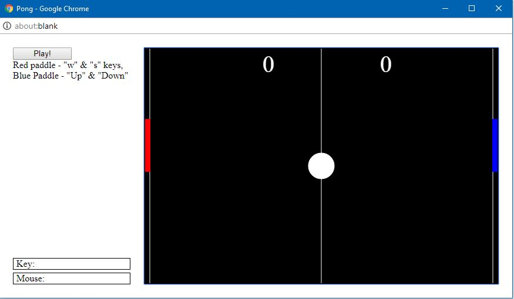
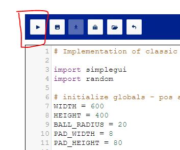

# Pong

The classic 2-player arcade game Ping-Pong with simplegui implementation in .

<i>CodeSkulptor is an interactive, web-based Python programming environment that allows Python code to be run in a web browser. The application was developed by Scott Rixner, a professor of computer science at Rice University, Texas.</i>

You can play the game here: 

Click on the run icon

## <b>Controls:</b>
<b>Red Paddle</b>: 'w' & 's' keys(for moving up and down respectively)

<b>Blue Paddle</b>: UP arrow & DOWN arrow keys(for moving up and down respectively)

